# Lab1 ONOS and Mininet Installation

> Student ID: 313551097
> Student Name: 鄭淮薰

## Part1: Answer Questions

### 1. When ONOS activate "org.onosproject.openflow," what APPs does it activate?

When ONOS activate "org.onosproject.openflow," it activates the following APPs:
- org.onosproject.hostprovider
- org.onosproject.lldpprovider
- org.onosproject.optical-model
- org.onosproject.openflow-base
- org.onosproject.openflow

|   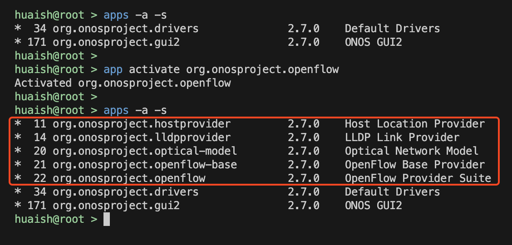    |
|:------------------------:|
| Figure 1: Activated APPs |

### 2. After we activate ONOS and run P.17 Mininet command, will H1 ping H2 successfully? Why or why not?

**Answer: No, H1 cannot ping H2 successfully.**

As shown in Figure 2, the ping fails because no flow rules are set on the data plane, so the switch doesn't know how to forward packets between H1 and H2. While ONOS has the Reactive Forwarding app (`org.onosproject.fwd`) to handle this automatically, it's turned off by default, as confirmed in Figure 3. That's why the ping doesn't go through.

|      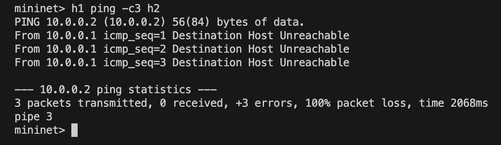      |       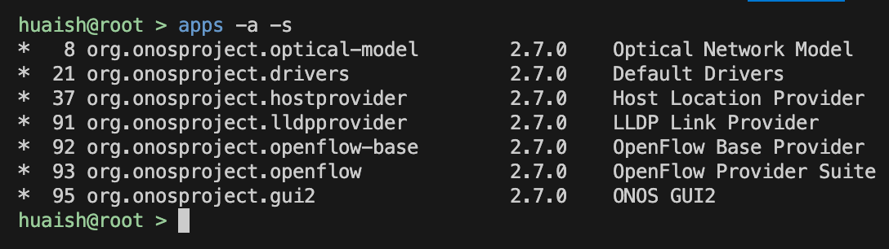        |
|:-----------------------------:|:--------------------------------:|
| Figure 2: Ping command result | Figure 3: Default activated APPs |

> Reference: there are no flows installed on the data-plane, which forward the traffic appropriately. -- [Basic ONOS tutorial](https://wiki.onosproject.org/display/ONOS/Basic+ONOS+Tutorial#BasicONOSTutorial-Nopings?Why?)

### 3. Which TCP port does the controller listen to the OpenFlow connection request from the switch?

**Answer: 6653**

In Figures 4.1 and 4.2, I compared the port states before and after starting the OpenFlow app and found that ports `6633` and `6653` are open only when the OpenFlow app is activated. This indicates that both ports may be used for OpenFlow connections.

|                    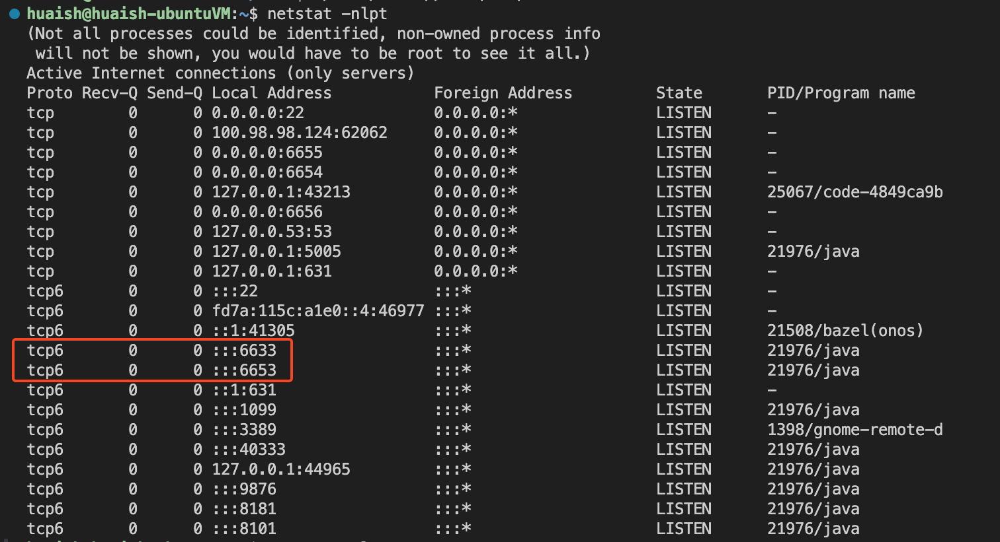                    |                     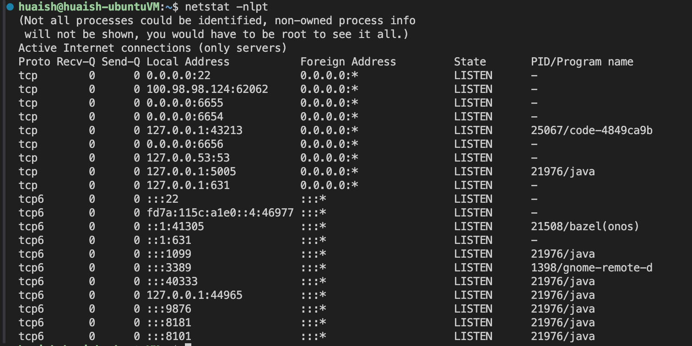                     |
|:-------------------------------------------------------------:|:---------------------------------------------------------------:|
| Figure 4.1: Port listening state<br>(activating OpenFlow app) | Figure 4.2: Port listening state<br>(deactivating OpenFlow app) |

Figure 5 shows that the switch *s1* communicates with the controller via port `56560`.
As shown in Figure 6, the tshark capture result confirms that the controller listens on port `6653` for OpenFlow connections.

|       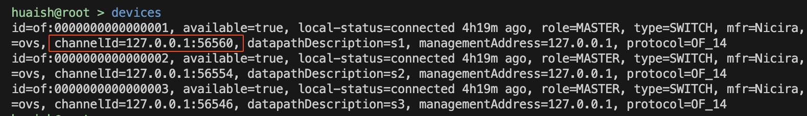       |       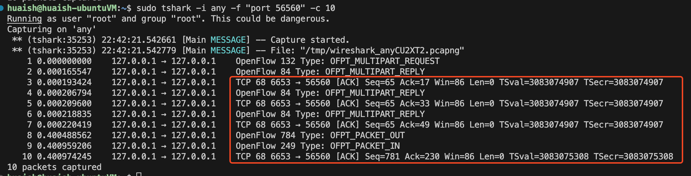       |
|:-------------------------------:|:-------------------------------:|
| Figure 5: Switch `s1` channelId | Figure 6: tshark capture result |


> Reference:
Controllers should listen on TCP port 6653 for switches that want to set up a connection. Earlier versions of the OpenFlow protocol unofficially used port 6633 -- [OpenFlow - Wikipedia](https://en.wikipedia.org/wiki/OpenFlow#:~:text=Controllers%20should%20listen%20on%20TCP,protocol%20unofficially%20used%20port%206633.)

### 4. In question 3, which APP enables the controller to listen on the TCP port?

**Answer: OpenFlow Base Provider (org.onosproject.openflow-base)**

1. When no APPs are deactivated (both **openflow-base** and **openflow** are activated), the controller listens on port `6653` for OpenFlow connections, as shown the top of Figure 7 (part 1). 

2. After deactivating the **openflow-base** app (both **openflow-base** and its dependencies are deactivated), we can see that port `6653` is no longer listening, as shown in the middle of Figure 7 (part 2).

3. When we activate the **openflow-base** app again (only **openflow-base** and its dependencies is activated), the controller listens on port `6653` again, as shown at the middle of Figure 7 (part 3).

4. When we deactivate the **openflow-base** but activate the **org.onosproject.optical-model** app which is the dependency of **openflow-base**, we can see that port `6653` is closed, as shown at the bottom of Figure 7 (part 4).

|                   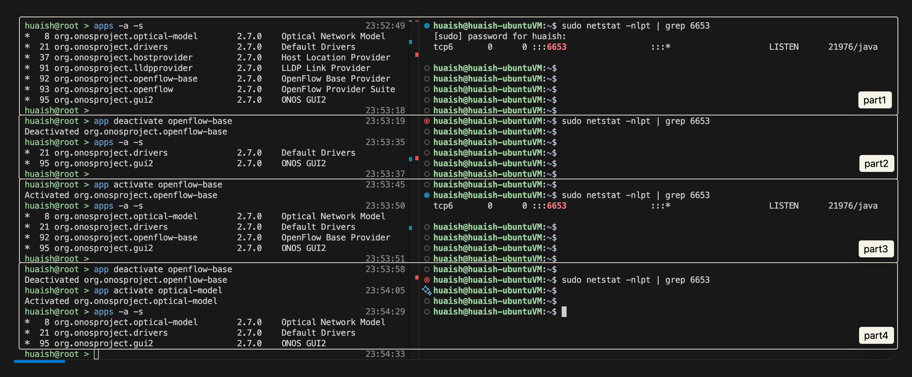                    |
|:--------------------------------------------------------:|
| Figure 7: Deactivate/Activate APPs and check port status |

From the above observations, we can conclude that the **openflow-base** app enables the controller to listen on the TCP port.

## Part2: Create a custom Topology

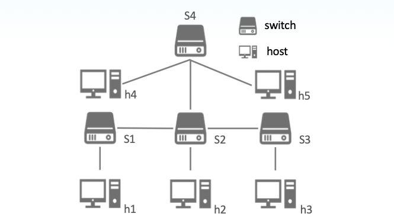

I created above custom topology with the following steps:

1. Add 5 hosts: `h1`, `h2`, `h3`, `h4`, `h5`
2. Add 4 switches: `S1`, `S2`, `S3`, `S4`
3. Add links between hosts and switches

The implementation of the custom topology is written in the Python script `lab1_part2_313551097.py`.

**Result:**

Figure 8 shows the custom topology on GUI after running the script.

|       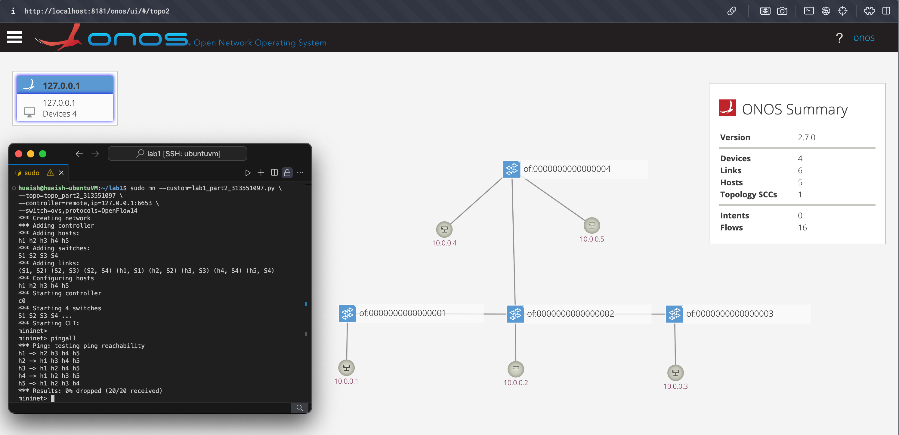        |
|:--------------------------------:|
| Figure 8: Custom Topology on GUI |

## Part3: Statically assign Hosts IP Address in Mininet

I manually assigned IP addresses as follows:

- IP addresses: 192.168.0.0/27

    | Host | IP Address  |
    |:----:|:-----------:|
    |  h1  | 192.168.0.1 |
    |  h2  | 192.168.0.2 |
    |  h3  | 192.168.0.3 |
    |  h4  | 192.168.0.4 |
    |  h5  | 192.168.0.5 |

- netmask: 255.255.255.244

To manually assign IP addresses to each host, you can assign the IP address when creating the host. For example:

```python
h1 = net.addHost('h1', ip='192.168.0.1/27')
h2 = net.addHost('h2', ip='192.168.0.2/27')
```

In this case, `/27` represents the netmask, which means the first 27 bits are network bits, and the remaining 5 bits are host bits. The binary representation of the netmask is `11111111.11111111.11111111.11100000`, which corresponds to `255.255.255.224` in decimal.

Thus, the subnet mask for `/27` is **`255.255.255.224`**.

The implementation of the custom topology with static IP addresses is written in the Python script `lab1_part3_313551097.py`.

**Result:**

Figure 9 shows the result of running the script.

|                     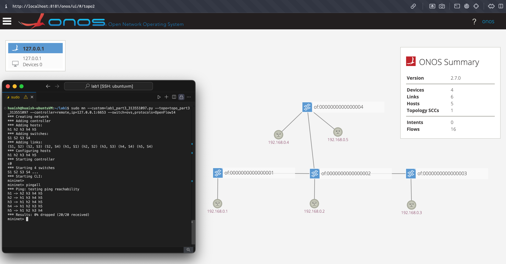                      |
|:------------------------------------------------------------:|
| Figure 9: Result of running script `lab1_part3_313551097.py` |

Figure 10 shows the result of running the `dump` command.

|              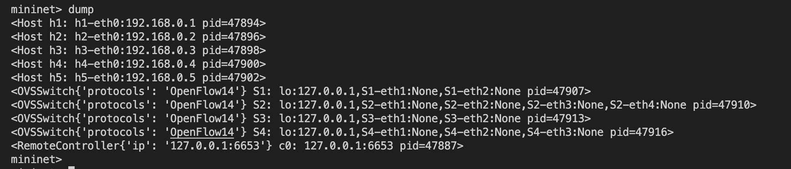              |
|:-----------------------------------------------:|
| Figure 10: Result of running the `dump` command |

Figure 11.1 to 11.5 show the result of running the `ifconfig` command on each host.

| 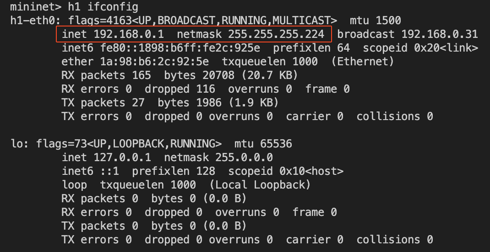 | 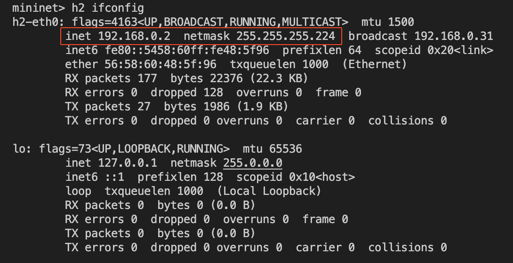 |
|:-------------------------:|:-------------------------:|
|      Figure 11.1: h1      |      Figure 11.2: h2      |
| 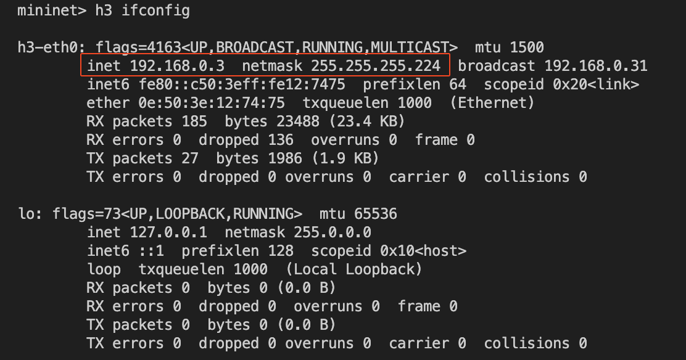 | 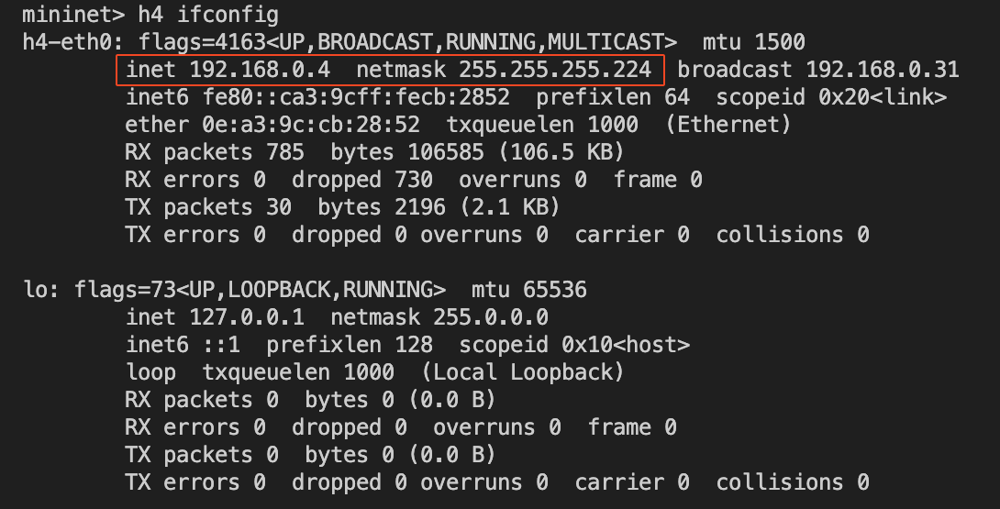 |
|      Figure 11.3: h3      |      Figure 11.4: h4      |
| 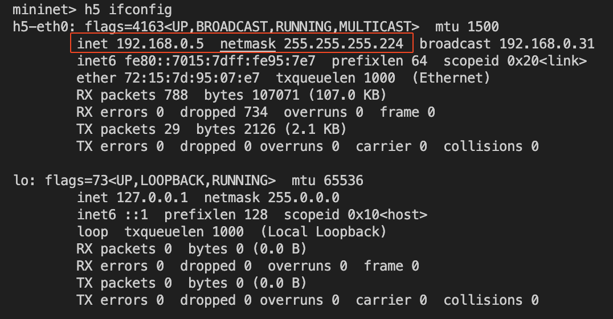 |                           |
|      Figure 11.5: h5      |                           |


## What you've learned or solved

Lab 1 provided a solid understanding of ONOS and Mininet, covering the relationship between controllers and switches, the role of ONOS apps, and how to create custom topologies. Through hands-on practice, I deepened my knowledge of network technologies, particularly in observing controller-switch interactions and interpreting network connections. Writing Python scripts for custom topologies enhanced my familiarity with Mininet and improved my understanding of IP address allocation in SDN environments. This lab effectively bridged theory and practice, equipping me with skills for configuring network topologies, laying a strong foundation for future network development.