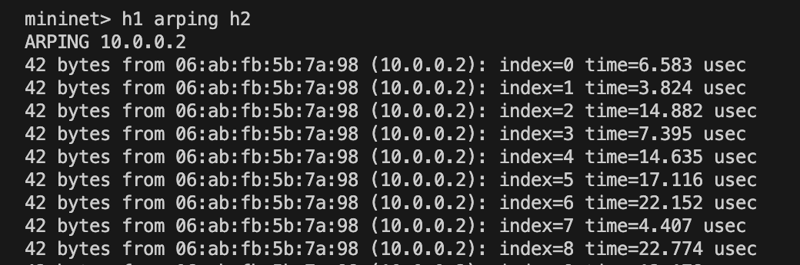
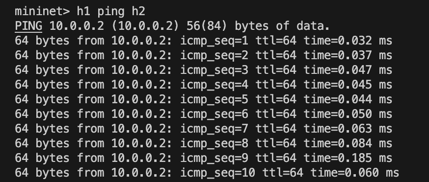
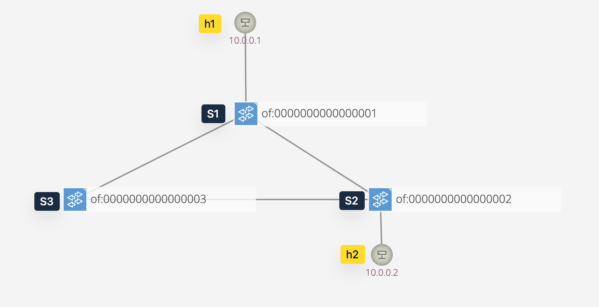
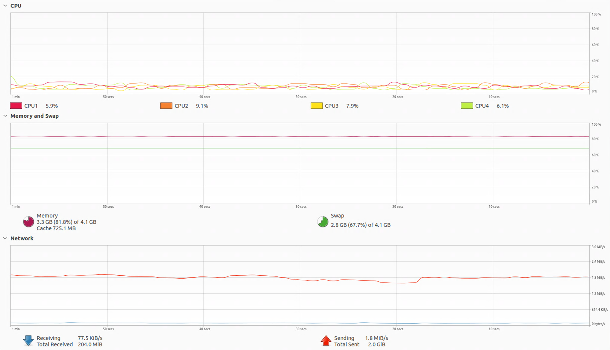
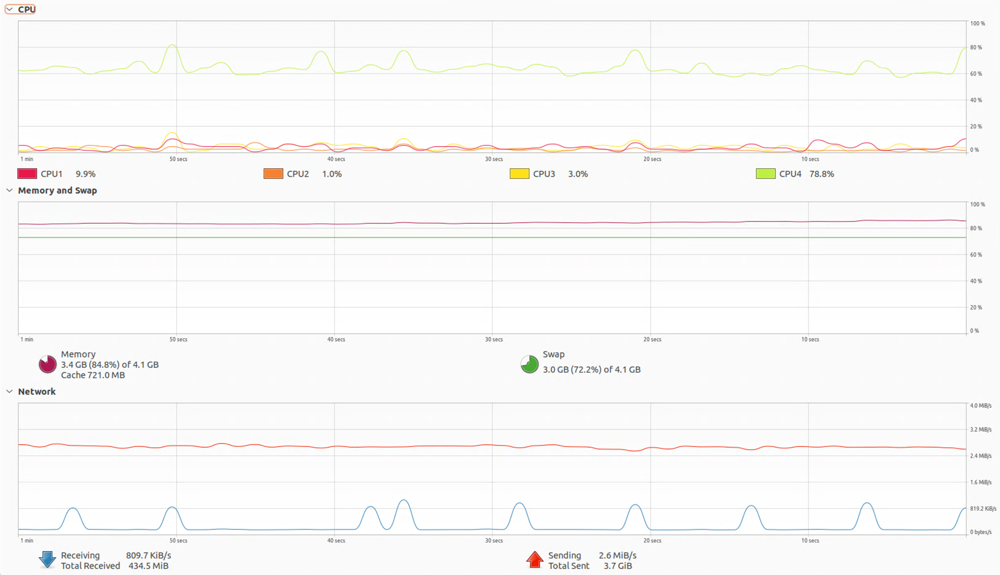

# Lab2 OpenFlow Protocol Observation and Flow Rule Installation

> Student ID: 313551097  
> Student Name: 鄭淮薰

## Part1: Answer Questions

There are 6 distinct "OFPT_FLOW_MOD" headers during the experiment.

| Match Fields                                                                |         Actions          | Timeout Values |
|:----------------------------------------------------------------------------|:------------------------:|:--------------:|
| ETH_TYPE = ipv4(0x0800)                                                     | OUTPUT PORT = CONTROLLER |       0        |
| ETH_TYPE = arp(0x0806)                                                      | OUTPUT PORT = CONTROLLER |       0        |
| ETH_TYPE = lldp(0x088cc)                                                    | OUTPUT PORT = CONTROLLER |       0        |
| ETH_TYPE = bddp(0x8942)                                                     | OUTPUT PORT = CONTROLLER |       0        |
| IN_PORT = 1,<br>ETH_DST = ae:a8:a3:d6:1e:d4,<br>ETH_SRC = 12:d3:e0:36:b0:f1 |     OUTPUT PORT = 2      |       10       |
| IN_PORT = 2,<br>ETH_DST = 12:d3:e0:36:b0:f1,<br>ETH_SRC = ae:a8:a3:d6:1e:d4 |     OUTPUT PORT = 1      |       10       |

## Part2: Install Flow Rules
1. Install one flow rule to forward ARP packets
    Install the flow rule:
    ```bash
    curl -u onos:rocks -X POST \
    -H 'Content-Type: application/json' \
    -d @flows_s1-1_313551097.json \
    'http://localhost:8181/onos/v1/flows/of:0000000000000001'
    ```

    Verify the flow rule:
    |                |
    |:---------------------------------:|
    | Figure 1: h1 arping h2 screenshot |


2. Install two flow rules to forward IPv4 packets
    Install first flow rule:
    ```bash
    curl -u onos:rocks -X POST \
    -H 'Content-Type: application/json' \
    -d @flows_s1-2_313551097.json \
    'http://localhost:8181/onos/v1/flows/of:0000000000000001'
    ```
    
    Install second flow rule:
    ```bash
    curl -u onos:rocks -X POST \
    -H 'Content-Type: application/json' \
    -d @flows_s1-3_313551097.json \
    'http://localhost:8181/onos/v1/flows/of:0000000000000001'
    ```
    
    Verify the flow rules:
    |              |
    |:-------------------------------:|
    | Figure 2: h1 ping h2 screenshot |
    

## Part3: Create Topology with Broadcast Storm

**Create topology**
I create a topology like Figure 3:

|                 |
|:----------------------------------:|
| Figure 3: Broadcast storm topology |

**Install flow rule**
Also, I create flow rules to forward ARP packets to all ports on each switch, which will lead to a broadcast storm.

**Scenario of Broadcast Storm**

- When `h1` sends an ARP request (a broadcast message), `S1` will forward this ARP packet to both `S2` and `S3`.
- `S2` will receive the packet from `S1` and forward it to both `S3` and `h2`, and `S3` will also forward it back to `S1`.
- The packet keeps circulating around the loop (`S1`, `S2`, `S3`), and because the packet is a broadcast, each switch forwards it to its neighbors.

**Result of Broadcast Storm**

The broadcast storm can be observed in the following screenshot:
|           |          |
|:----------------------------:|:---------------------------:|
| Figure 4: (Before) CPU Usage | Figure 5: (After) CPU Usage |


## Part4: Trace ReactiveForwarding

When `h1` pings `h2`, the following events occur (D: Date Plane, C: Control Plane):

1. D: `h1` sends an ARP request to `h2`. (Who has 10.0.0.2? Tell 10.0.0.1)
2. D → C: `S1` receives the ARP request and sends it to the controller because there is no corresponding flow rule. (PACKET_IN: IN_PORT=1)
3. C → D: The controller instructs `S1` to forward the request to all other ports, effectively broadcasting the ARP request in hopes of finding `h2`. (PACKET_OUT: OUTPUT=FLOOD)
4. D: `S1` forwards the ARP request to all other ports except the incoming port.
5. D: `h2` receives the ARP request and sends an ARP reply. (10.0.0.2 is at 72:69:b6:3c:cb:12)
6. D → C: `S1` receives the ARP reply and sends it to the controller because there is no corresponding flow rule. (PACKET_IN: IN_PORT=2)
7. C → D: The controller instructs `S1` to forward the reply to `h1`. (PACKET_OUT: OUTPUT=1)
8. D: `S1` forwards the ARP reply to `h1`.
9. D: `h1` receives the ARP reply and sends an ICMP echo request to `h2`.
10. D → C: `S1` receives the ICMP echo request and sends it to the controller because there is no corresponding flow rule. (PACKET_IN: IN_PORT=1)
11. C → D: The controller instructs `S1` to forward the ICMP echo request to `h2`. (PACKET_OUT: OUTPUT=2)
12. D: `S1` forwards the ICMP echo request to `h2`.
13. D: `h2` receives the first ICMP request.

## What you've learned or solved

Through the Lab 2 exercises, I gained a deeper understanding of how flow rules work. In particular, the process of using Wireshark to observe packets in Part 4 gave me a clearer view of the interaction between the Data Plane and the Control Plane. Starting from Part 1, I learned how to capture packets with Wireshark, followed by learning how to install flow rules in Part 2. In Part 3, I gained insight into the broadcast storm issue, and finally, in Part 4, I observed the reactive forwarding process through Wireshark. This step-by-step learning approach helped me better understand how the OpenFlow Protocol operates.

Additionally, in the Part 4 exercise, I initially encountered some difficulties in understanding the packet flow. Later, I realized that I was only capturing packets on the Loopback: lo interface and missed the packets on the s1-eth1 and s1-eth2 interfaces, which prevented me from observing the packet exchange between h1 and h2. This experience taught me that packets may traverse different interfaces, so it is important to select the correct interface when using Wireshark for packet analysis.