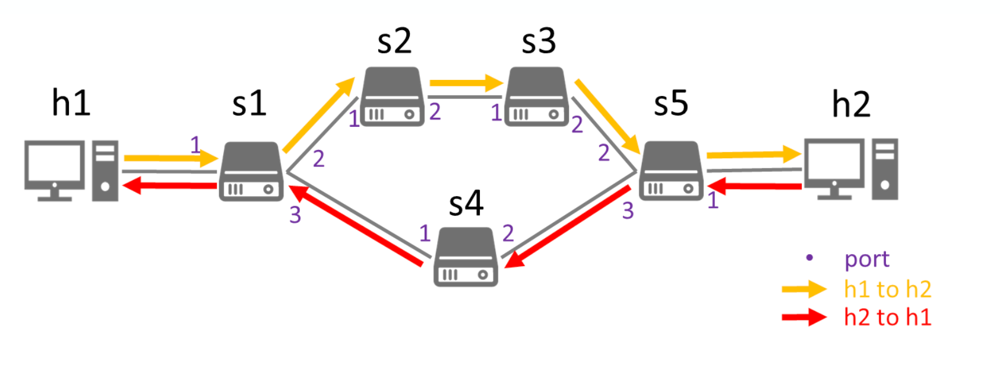

# Lab 4 Report

> Student Name: 鄭淮薰  
> Student ID: 313551097

## Introduction

In this lab, I implemented a groupmeter app to control traffic flow and apply rate limits in a ring network topology using SDN. The app configures group tables and meter rules on the switches, allowing me to manage traffic paths and limit bandwidth when needed. This setup helps direct traffic between hosts, reroute it when links go down, and enforce rate limits to control network congestion. Using the groupmeter app, I tested different scenarios to observe how the app affects traffic behavior and flow.

## Test Results
### Workflow1 - s1-s2 link up



In Workflow1, I set up a ring topology with 5 switches and 5 hosts. I configured h1 as the iperf UDP client and h2 as the iperf UDP server to test network traffic. With s1 connected to s2, the group table on s1 directs traffic from h1 to h2 to flow through s2 and s3. The following steps detail the process and results of Workflow1.

1. **Build the topology**
    
    I run the following command to build a ring topology, as shown in Figure1.

    ```shell
    $ sudo mn --custom=ring_topo.py --topo=mytopo \
    --controller=remote,ip=127.0.0.1,port=6653 \
    --switch=ovs,protocols=OpenFlow14
    ```

    |                Figure1: Topology                 |
    |:------------------------------------------------:|
    |  |

2. **Upload config file to ONOS**
    
    Then I upload the config file `hostconfig.json` to ONOS by the following command.

    ```shell
    $ onos-netcfg localhost hostconfig.json
    ```

    | Figure2: Upload config file to ONOS |
    |:-----------------------------------:|
    |    |

3. **Build, install, and activate your App**

    After building, installing, and activating the groupmeter App, our app receives the configuration from the uploaded config and installs the necessary group, meter, and flow rules to the switches. Figure3 shows the log of configuration information.

    | Figure3: Build, install, and activate groupmeter App |
    |:----------------------------------------------------:|
    |                               |

4. **Use h1 as iperf UDP client and h2 as iperf UDP server to test your traffic**
    
    Next, I used iperf UDP on h1 to h2 to test the traffic. The result is shown in Figure4. The yellow box in Figure4 shows the intent information log indicating that our app has installed the intent right after udp packet-in.

    | Figure4: Run iperf UDP on h1 to h2 |
    |:----------------------------------:|
    |           |

5. **Monitor s1 and s4 interface**

    - **Check if traffic from h1 to h2 through s2 and s3**

        Figures 5 and 6 show the port dumps for s1 and s4. About 3,000 packets pass through port "s1-eth2," while only around 100 packets go through port "s1-eth3" toward s4. This shows that the UDP traffic from h1 to h2 primarily goes through s2 and s3.


        |          Figure5: s1 dump-ports           |          Figure6: s4 dump-ports           |
        |:-----------------------------------------:|:-----------------------------------------:|
        |  |  |
    
    - **Check the path from h2 to h1 through which switch**

        To verify the path from h2 to h1, we first examine the flow table of s5, shown in Figure7. The flow table on s5 includes a rule that forwards packets to port 3, which is connected to s4.

        |  Figure7: flow table  |
        |:---------------------:|
        |  |

        To further confirm this path, I conducted an additional test by running iperf UDP from h2 to h1 while monitoring the port dumps on s5. As shown in Figure8, the traffic from h2 to h1 indeed passes through port "s5-eth3.", confirming that the path from h2 to h1 goes through s4.

        |        Figure8: s5 dump-ports         |
        |:-------------------------------------:|
        |  |

<div style="break-after:page"></div>

### Workflow2 - s1-s3 link down


Workflow2 is similar to Workflow1, but with the s1-s2 link down. Thus, s1 will direct traffic from h1 to h2 to flow through s4. Also, the traffic rate will be limited by the meter rule on s4. The following steps detail the process and results of Workflow2.

6. **Turn down s1–s2 link**

    I run the following command to turn down the s1-s2 link.

    ```shell
    mininet> link s1 s2 down
    ```
    |                 Figure9: Topology                  |
    |:--------------------------------------------------:|
    |  |


7. **Run iperf UDP on h1 to h2**

    I tested the traffic by running iperf UDP on h1 to h2. The result is shown in Figure10. The yellow box in Figure10 shows the intent information log indicating that our app has installed the intent right after udp packet-in.

    |         Figure10: Run iperf UDP on h1 to h2          |
    |:----------------------------------------------------:|
    |  |

8. **Monitor s1 and s4 interface**
    - **Check if both traffic go through s4**

        Figures 11 and 12 display the port dumps for s1 and s4. Originally, as see in Figure 5, port "s1-eth3" was handling around 100 packets, but after the s1-s2 link goes down, this number increases to 3,000 packets. This indicates that the traffic from h1 to h2 is now being rerouted through s4.

        |    Figure11: s1 dump-ports (link down)    |    Figure12: s4 dump-ports (link down)    |
        |:-----------------------------------------:|:-----------------------------------------:|
        |  |  |
    
    - **Check if the iperf traffic rate is limited**

        To verify that the traffic rate is limited by the meter on s4, I ran an iperf UDP test from h1 to h2 while monitoring the port dumps on s4. Figure 14 shows that when traffic flows through s4, the meter enforces a 1 Mbps cap, resulting in reduced throughput and potential packet drops once the rate exceeds the limit. The meter on s4 monitors traffic and allows bursts up to 1024 KB, but once the burst buffer is exceeded and traffic surpasses 512 KB/sec, the meter begins dropping excess packets. In contrast, Figure 13 shows traffic passing through s2 without any rate limit, allowing higher sustained bandwidth and no packet loss.

        |      Figure13: h2 jobs (no rate limit)      |     Figure14: h2 jobs (rate limit)      |
        |:-------------------------------------------:|:---------------------------------------:|
        |  |  |